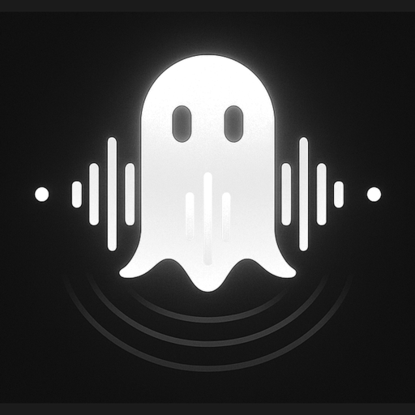
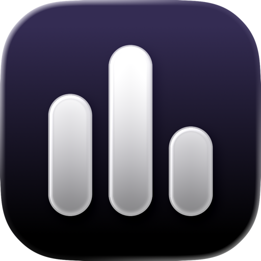

## Hey, I’m Will 👋

I build apps, make music, and follow the occasional “what if?” a little too far.
I build with mostly **SwiftUI and TypeScript**. A lot of MacOS native apps (a lot), tools for musicians, and dev tools to make my workflow more efficient 

I like thoughtful interfaces, useful little details, software that respects your privacy, and software that isn't annoying to use.

### Things I’m building

<table>
  <tr>
    <td width="82" align="center"></td>
    <td><strong><a href="https://github.com/svvayyy/ghostbeat">Ghost Beat</a></strong> A timing trainer for musicians. Helps you improve your internal timing and practice better. Music · iPhone · SwiftUI</td>
  </tr>
  <tr>
    <td width="82" align="center"></td>
    <td><strong><a href="https://github.com/svvayyy/ClipTape">ClipTape</a></strong> A free, open-source macOS screen recorder that makes recording fast and not a whole "event."  macOS · SwiftUI · On-device</td>
  </tr>
  <tr>
    <td width="82" align="center"></td>
    <td><strong><a href="https://github.com/svvayyy/Muxtra">Muxtra</a></strong> A workspace for coding agents. It makes separate branches so agent stop stepping on each other's work. Developer tools · TypeScript · Public beta</td>
  </tr>
</table>

### Outside the code

Drums, music, and a growing collection of ideas that were supposed to be “small projects.”

---

Built with too much curiosity, like way too much.
