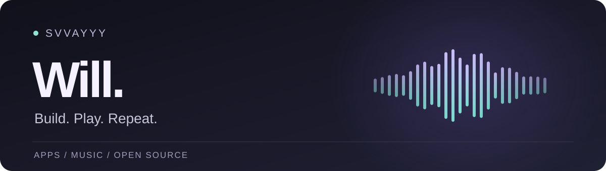

  

## Hey, I’m Will 👋

I build apps, make music, and follow the occasional “what if?” a little too far.
Mostly **SwiftUI and TypeScript**—native apps, tools for musicians, and ways to make working with AI less chaotic.

I like thoughtful interfaces, useful little details, and software that respects your privacy.

### Things I’m building

<table>
  <tr>
    <td width="82" align="center"></td>
    <td><strong><a href="https://github.com/svvayyy/ghostbeat">Ghost Beat</a></strong> A timing trainer for musicians. Build the internal clock, not just follow the click. Music · iPhone · SwiftUI</td>
  </tr>
  <tr>
    <td width="82" align="center"></td>
    <td><strong><a href="https://github.com/svvayyy/ClipTape">ClipTape</a></strong> A free, open-source macOS screen recorder. Record, save, done. macOS · SwiftUI · On-device</td>
  </tr>
  <tr>
    <td width="82" align="center"></td>
    <td><strong><a href="https://github.com/svvayyy/Muxtra">Muxtra</a></strong> A workspace for coding agents: separate branches, less stepping on each other’s work. Developer tools · TypeScript · Public beta</td>
  </tr>
</table>

Also: **[Nudge](https://svvayyy.github.io/nudge/)**, a spin-to-decide productivity app for iPhone.

### A little open source

Recently contributed to **[bg0](https://github.com/opencoredev/bg0)**, a browser-only background remover:

- [Made the result toolbar work better on narrow screens.](https://github.com/opencoredev/bg0/pull/17)
- [Helped bring lower-memory BiRefNet inference to iPhone and iPad.](https://github.com/opencoredev/bg0/pull/19) Tested on my iPhone 13; broader device coverage is still a work in progress.

### Outside the code

Drums, music, and a growing collection of ideas that were supposed to be “small projects.”

---

Built with curiosity. Usually accompanied by a drum groove.
